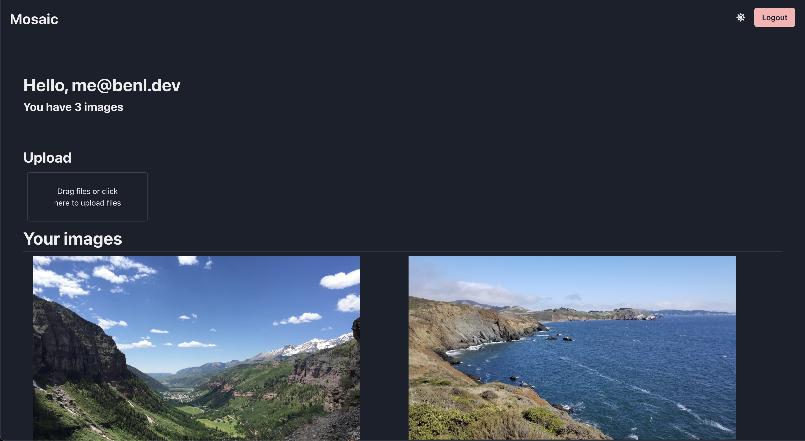

# Mosaic

Mosaic is an image repository that is designed to host and manage screenshots that you have taken. Since these type of images are more of a temporary

View a hosted version [here](https://mosaic.benl.dev).




## Development

### Initial Setup/Configuration

Getting development working on your local machine could be a bit tricky because you need a fair amount of API keys for configuration to get everything working together.

All of the required variables that you need are in the .env files within the /frontend and /server.

#### Dependencies

-   Auth0 application for setting up auth keys for authentication to work

-   GCP Application so that you can setup all the Google Uploading / CDN / Load Balancing and other shorting.

-   A domain that will allow you to do the CDN forwarding for your "short" urls.

-   Docker

-   Yarn

-   Node

-   Golang

Once you have everything installed and credentials in the correct place, you will need to open 3 different terminal windows.

### Getting the frontend running

The first one will be used to run the frontend. To get the frontend running, run the following commands in your terminal window.

```sh
$ cd frontend
$ yarn install
$ yarn start
```

### Getting the database running

The second terminal window will be used to run the docker-compose, which will get mongo and other depencencies running on your machine.

Starting in the root directory, run this command.

```sh
$ docker-compose up --build
```

### Getting the backend running

In the third terminal window, run the following set of commands starting in the root directory.

```sh
$ cd server
$ go build && ./mosaic
```

As long as the database is running and you have the correct GCP credentials and path to those credentials setup, you should be good to go!

## Viewing

Now that everything is running, you should be able to visit http://localhost:3000/ to view the frontend.
